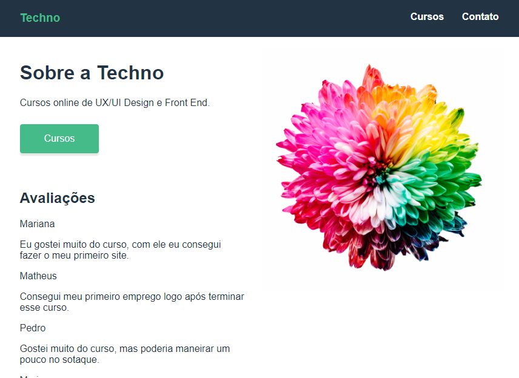

# Techno

Cursos online da empresa fictícia Techno

## Descrição do projeto: 

Desenvolvido como parte do curso de Vue da Origamid, com o objetivo de simular o funcionamento de um site, consumindo a base dados de uma API ficitícia criada com o JSON-SERVER.

## Funcionalidades do projeto

* `Funcionalidade 1`: Visualizar os cursos oferecidos pelo site;
* `Funcionalidade 2`: Visualizar os vídeos de exemplo dos cursos;

## Demo:



## Instação:

### Clonar o repositório:
```
$ git clone https://github.com/albertoafaj/dogs.git
```
### Instalar as dependências:
```
$ npm install
```
### Rodando API Fictícia

#### Instale o JSON Server
```
$ npm install -g json-server
```

#### Rode a API
```
$ cd .\techno-cursos-api\ 
$ json-server --watch api.json
```

### Rodando a aplicação:
```
$ npm run serve
```

## Tecnologias utilizadas

* Vue 3
* Router Vue
* JSON SERVER